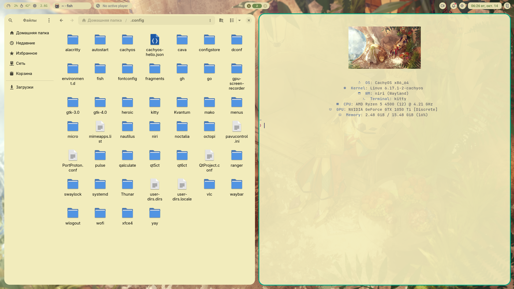
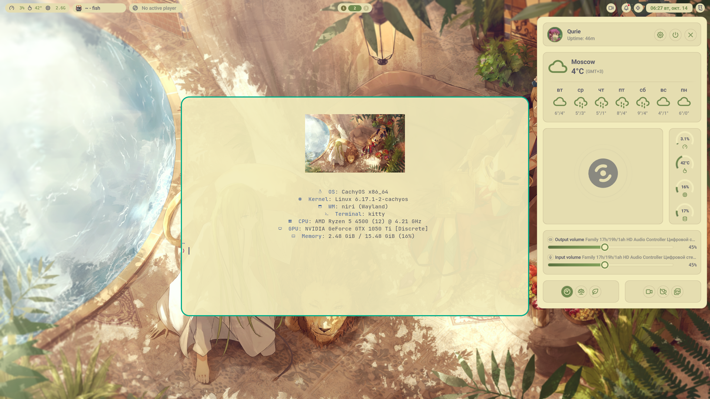
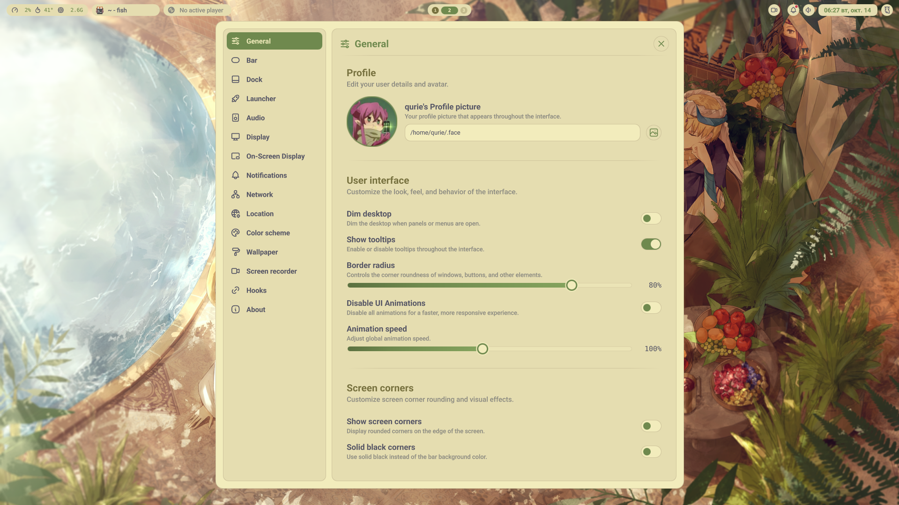

<div align="center">

# 🌙 Qurie's Noctalia-Niri Rice

**Полностью кастомизированный Wayland desktop на основе Noctalia Shell + Niri для CachyOS**



[](https://claude.ai/claude-code)
[](https://github.com/noctalia-dev/noctalia-shell)
[](https://github.com/YaLTeR/niri)
[](https://cachyos.org/)

</div>

---

## ✨ Особенности

<table>
<tr>
<td width="50%">

### 🎨 Темизация
- **Автоматическая генерация цветовых схем** из обоев через matugen
- **Универсальная поддержка** Qt5, Qt6, GTK3, GTK4, Firefox/Zen (Pywalfox), Kitty
- **10+ предустановленных схем**: Kanagawa, Catppuccin, Gruvbox, Solarized, Monochrome и др.
- **Мгновенное применение** при смене обоев или схемы

</td>
<td width="50%">

### 🚀 Производительность
- **Niri compositor** — современный тайловый Wayland менеджер окон
- **GPU Screen Recorder** — встроенная запись экрана с аппаратным ускорением
- **NVIDIA Wayland оптимизации** — полная поддержка NVIDIA GPU на Wayland
- **Быстрые анимации** и плавная работа на любом железе

</td>
</tr>
<tr>
<td width="50%">

### 🛠️ Исправления и улучшения
- ✅ **Исправлена Qt интеграция** — добавлен `custom_palette=true` в qt5ct/qt6ct
- ✅ **Исправлена GTK3 темизация** — автогенерация кастомной темы с хардкод-цветами
- ✅ **Добавлен недостающий цвет `scrim`** для predefined схем
- ✅ **Универсальный GTK шаблон** — работает одновременно для GTK3 и GTK4 без артефактов

</td>
<td width="50%">

### 🎯 UI/UX
- **Виджетная система баров** — полная кастомизация верхнего панели
- **Dock приложений** — красивый док с автоскрытием
- **Продвинутый лаунчер** — fuzzy search, история запусков, закреплённые приложения
- **Control Center** — быстрые настройки Wi-Fi, Bluetooth, Яркость, Power Profile

</td>
</tr>
</table>

---

## 🖼️ Скриншоты

<details>
<summary><b>Нажмите, чтобы посмотреть скриншоты</b></summary>


*Основной рабочий стол с Noctalia Bar и активными окнами*


*Лаунчер приложений с fuzzy search*


*Control Center с быстрыми настройками*

</details>

---

## 🚀 Быстрая установка

```bash
# Клонируем репозиторий
git clone https://github.com/QurieGLord/Quries-Noctalia-Niri.git ~/dotfiles
cd ~/dotfiles

# Даём права на выполнение
chmod +x install.sh

# Запускаем установщик
./install.sh
```

Установщик поддерживает **3 режима**:
1. **Полная установка** — установка всех модулей (база + NVIDIA + Qt + GTK)
2. **Выборочная установка** — выбор отдельных модулей
3. **Обновление конфигов** — обновление только конфигов без переустановки пакетов

---

## 📦 Модули установки

### 🔹 Base Module
Базовая установка Noctalia Shell + Niri + зависимости:
- Noctalia Shell (AUR), Niri compositor
- Kitty terminal, Nautilus file manager
- Brightnessctl, ddcutil, gpu-screen-recorder
- Matugen-bin, cliphist, wlsunset
- Иконочные темы: Tela-nord-dark, Papirus-Dark
- Шрифты: Roboto, Inter, JetBrains Mono Nerd Font, DejaVu Sans Mono

**Включает применение патчей**:
- `AppThemeService.qml` — исправленный сервис тем с GTK3 генерацией
- `gtk.css` — универсальный шаблон с CSS селекторами для GTK3/GTK4

### 🔹 NVIDIA Module
NVIDIA Wayland оптимизации:
- Драйвера: nvidia-dkms, nvidia-utils, nvidia-settings, libva-nvidia-driver
- Переменные окружения: `GBM_BACKEND=nvidia-drm`, `__GLX_VENDOR_LIBRARY_NAME=nvidia`
- Модули ядра: `nvidia-drm modeset=1`, `NVreg_PreserveVideoMemoryAllocations=1`
- Автоматическое обновление initramfs

### 🔹 Qt Integration Module
Qt5/Qt6 установка и настройка:
- Пакеты: qt5-base, qt6-base, qt5ct, qt6ct
- **Критичный фикс**: `custom_palette=true` в обоих конфигах
- Настройка переменных окружения: `QT_QPA_PLATFORMTHEME=qt6ct`
- Верификация конфигов

### 🔹 GTK Integration Module
GTK3/GTK4 установка:
- Пакеты: gtk3, gtk4, libadwaita
- Тестовые приложения: qalculate-gtk, gnome-calculator
- Копирование конфигов, создание кастомной GTK3 темы Noctalia
- Настройка gsettings: gtk-theme, icon-theme, color-scheme
- Верификация

---

## 🛠️ Технические детали

### Исправления в Noctalia Shell

#### 1. AppThemeService.qml
**Местоположение**: `patches/noctalia-shell/AppThemeService.qml`

**Изменения**:
- **Строки 200-201**: Добавлен недостающий цвет `scrim = "#000000"` (критично для predefined схем)
- **Строка 234**: Добавлен ключ `"scrim": c(scrim)` в объект палитры
- **Строки 255-289**: Новая функция `generateGtk3Theme()` — автогенерирует кастомную GTK3 тему с хардкод-цветами (без CSS переменных, т.к. GTK3 их не понимает)

**Эффект**: Теперь при смене цветовой схемы автоматически создаётся `~/.themes/Noctalia/gtk-3.0/gtk.css` с прямыми цветами для всех виджетов (window, sidebar, headerbar, buttons, entries, lists, menus, notebooks, tabs, frames, scrollbars, toolbars, switches, checkboxes, progress bars, dialogs, labels).

#### 2. Assets/MatugenTemplates/gtk.css
**Изменение**: Расширен шаблон GTK с добавлением ~30 типов CSS селекторов для GTK3 виджетов.

**Критично**: Стили для `popover, popover.background` **НЕ добавлены** — они ломают backdrop рендеринг в GTK4!

**Размер**: 339 строк (CSS переменные для GTK4 + прямые селекторы для GTK3)

**Эффект**: Один шаблон работает одновременно для GTK3 и GTK4 без артефактов и белых квадратов за контекстными меню.

#### 3. Qt5ct/Qt6ct конфигурация
**Изменение**: Установлен `custom_palette=true` в `qt5ct.conf` и `qt6ct.conf`.

**Корневая причина проблемы**: По умолчанию `custom_palette=false`, из-за чего Qt приложения игнорировали `color_scheme_path` и не применяли цвета из `~/.config/qt{5,6}ct/colors/noctalia.conf`.

**Эффект**: Qt5/Qt6 приложения теперь корректно применяют цвета из Noctalia при запуске.

---

### Поддерживаемые приложения

| Тип | Приложения | Механизм темизации |
|-----|-----------|-------------------|
| **Qt6** | Noctalia Shell, qt6ct | `~/.config/qt6ct/colors/noctalia.conf` + `custom_palette=true` |
| **Qt5** | Telegram Desktop, qt5ct | `~/.config/qt5ct/colors/noctalia.conf` + `custom_palette=true` |
| **GTK4** | Nautilus, Calculator, pwvucontrol | Material Design переменные + `org.gnome.desktop.interface color-scheme` через xdg-desktop-portal-gnome |
| **GTK3** | Lutris, qalculate-gtk | Кастомная тема `~/.themes/Noctalia/gtk-3.0/gtk.css` с хардкод-цветами |
| **Firefox/Zen** | Zen Browser, Firefox | Pywalfox + `~/.cache/wal/colors.json` (требуется установка расширения) |
| **Kitty** | Kitty Terminal | `~/.config/kitty/current-theme.conf` (мониторит изменения через inotify) |

---

## 🎨 Цветовые схемы

### Предустановленные схемы
- **Kanagawa** — тёмная схема, вдохновлённая японской живописью
- **Catppuccin** — мягкие пастельные тона
- **Gruvbox** — ретро-тёплая палитра
- **Solarized** — классическая тёмная/светлая схема
- **Monochrome** — минималистичная чёрно-белая схема
- **Material Design** — Google Material Design
- **Nord** — холодные арктические тона
- **Dracula** — тёмная схема с яркими акцентами

### Генерация из обоев
1. Откройте Noctalia Settings → Color Schemes
2. Включите "Use Wallpaper Colors"
3. Выберите обои через Wallpaper Selector
4. Noctalia автоматически вызовет `matugen` для генерации палитры
5. Цвета применятся ко всем приложениям через шаблоны

---

## 🔧 Требования

- **OS**: CachyOS / Arch Linux (или другой Arch-based дистрибутив)
- **Display Server**: Wayland
- **Compositor**: Niri (будет установлен автоматически)
- **Shell**: Noctalia Shell (будет установлен из AUR)

**Опционально**:
- NVIDIA GPU для установки NVIDIA модуля
- Pywalfox для темизации Firefox/Zen Browser

---

## 📁 Структура репозитория

```
Quries-Noctalia-Niri/
├── README.md                       # Этот файл
├── install.sh                      # Главный установочный скрипт
├── modules/                        # Модули установки
│   ├── base.sh                    # Базовая установка (Noctalia + Niri + зависимости)
│   ├── nvidia.sh                  # NVIDIA Wayland оптимизации
│   ├── qt-integration.sh          # Qt5/Qt6 интеграция с цветовыми схемами
│   └── gtk-integration.sh         # GTK3/GTK4 интеграция с цветовыми схемами
├── config/                         # Конфигурационные файлы
│   ├── niri/                      # Niri compositor конфигурация
│   │   └── config.kdl             # Биндинги, воркспейсы, настройки
│   ├── kitty/                     # Kitty terminal
│   │   └── kitty.conf             # JetBrains Mono Nerd Font + динамические темы
│   ├── noctalia/                  # Noctalia настройки
│   │   ├── settings.json          # Основные настройки
│   │   └── colors.json            # Активная цветовая схема
│   ├── qt5ct/                     # Qt5 настройки
│   │   ├── qt5ct.conf             # custom_palette=true, icon_theme, fonts
│   │   └── colors/noctalia.conf   # Автогенерируемая палитра
│   ├── qt6ct/                     # Qt6 настройки
│   │   ├── qt6ct.conf             # custom_palette=true, icon_theme, fonts
│   │   └── colors/noctalia.conf   # Автогенерируемая палитра
│   ├── gtk-3.0/                   # GTK3 настройки
│   │   ├── settings.ini           # gtk-theme, icon-theme, cursor-theme
│   │   └── gtk.css                # Автогенерируемые стили
│   ├── gtk-4.0/                   # GTK4 настройки
│   │   ├── settings.ini           # gtk-theme, icon-theme, cursor-theme
│   │   └── gtk.css                # Автогенерируемые стили (Material Design переменные)
│   └── .face                      # Аватар пользователя
├── scripts/                        # Вспомогательные скрипты
│   ├── update_micro_theme.sh      # Синхронизация цветов с micro editor
│   ├── update_qt_colorscheme.sh   # Ручное обновление Qt цветовой схемы
│   └── fetch-centered             # Кастомный системный информер
├── patches/                        # Патчи для Noctalia Shell
│   └── noctalia-shell/
│       ├── AppThemeService.qml    # Исправленный сервис тем (GTK3 generation + scrim fix)
│       └── gtk.css                # Универсальный GTK шаблон (GTK3 + GTK4)
├── qn1.png                         # Скриншот 1
├── qn2.png                         # Скриншот 2
└── qn3.png                         # Скриншот 3
```

---

## 🐛 Известные проблемы и решения

### GTK4 приложения не подхватывают изменения цветовых схем
**Проблема**: GTK4/libadwaita приложения (Nautilus, Calculator) подхватывают новые цвета только после перезапуска.

**Причина**: `AdwStyleManager` читает `org.gnome.desktop.interface color-scheme` через portal только при инициализации, без подписки на изменения.

**Решение**: Перезапускайте GTK4 приложения после смены цветовой схемы. Nautilus можно перезапустить через биндинг `MOD+E` в Niri (включает `killall nautilus`).

### Белый квадрат за контекстными меню в Nautilus
**Проблема**: При открытии контекстного меню (правый клик) появляется белый прямоугольный артефакт.

**Причина**: Кастомные CSS правила для `popover, popover.background` ломают backdrop рендеринг GTK4.

**Решение**: **НЕ ДОБАВЛЯЙТЕ** стили для `popover, popover.background, .context-menu` в `~/.config/gtk-4.0/gtk.css`. Используйте только стили для `menu, .menu` (для GTK3 контекстных меню).

### Hook скрипт apply_gtk_css_rules.sh добавляет проблемные стили
**Решение**: Hook скрипт `apply_gtk_css_rules.sh` **отключен** в `~/.config/noctalia/settings.json`. Если вы видите проблемы с GTK4 меню, удалите старые CSS файлы и переключите цветовую схему для регенерации:
```bash
rm ~/.config/gtk-3.0/gtk.css ~/.config/gtk-4.0/gtk.css
systemctl --user restart noctalia.service
# Затем переключите цветовую схему в Noctalia Settings
```

---

## 🤝 Благодарности

- **[Noctalia Shell](https://github.com/noctalia-dev/noctalia-shell)** — за потрясающий Wayland shell на базе Quickshell/QML
- **[Niri](https://github.com/YaLTeR/niri)** — за современный тайловый Wayland compositor
- **[Matugen](https://github.com/InioX/matugen)** — за генерацию Material Design цветовых схем из обоев
- **[Claude Code](https://claude.ai/claude-code)** — за помощь в написании кода, исправлении багов и создании этого репозитория

---

## 📄 Лицензия

**MIT License** (для моих кастомизаций и скриптов)

Noctalia Shell, Niri и другие upstream проекты имеют собственные лицензии — см. их репозитории.

---

<div align="center">

**Made with ❤️ and [Claude Code](https://claude.ai/claude-code) by Qurie**

⭐ Star this repo if you like it!

</div>
